# Microsoft Intune Endpoint Management Lab

## Overview

This project demonstrates the design and implementation of a cloud-based Windows endpoint management environment using Microsoft Intune and Microsoft Entra ID.

The lab simulates endpoint administration for a fictional organization, Summit Technology, and covers the lifecycle of a managed Windows 11 endpoint—from enrollment and security configuration to compliance monitoring, encryption, application deployment, and remote administration.

The environment was built to provide hands-on experience with modern endpoint management technologies commonly used in enterprise IT environments.

## Technologies Used

- Microsoft Intune
- Microsoft Entra ID
- Microsoft 365
- Windows 11
- Windows Autopilot
- Microsoft Defender Antivirus
- Microsoft BitLocker
- PowerShell
- Oracle VirtualBox

## Project Objectives

The primary objectives of this project were to:

- Configure Microsoft Intune as the organization's Mobile Device Management (MDM) platform
- Enroll and manage a Windows 11 endpoint through Intune
- Create and deploy Windows security configuration policies
- Implement device compliance requirements
- Configure and verify BitLocker drive encryption
- Configure Microsoft Defender Antivirus endpoint security policies
- Configure Windows Autopilot for automated device provisioning
- Deploy the Microsoft Company Portal through Intune
- Perform and verify remote device management actions

## Lab Environment

| Component | Configuration |
|---|---|
| Organization | Summit Technology |
| Identity Platform | Microsoft Entra ID |
| Endpoint Management | Microsoft Intune |
| Client OS | Windows 11 |
| Test Endpoint | SUMMIT-W11-01 |
| Virtualization | Oracle VirtualBox |
| Device Ownership | Corporate |
| Management Authority | Microsoft Intune |

## Windows Device Enrollment & Intune Management

The first step in building the endpoint management environment was configuring Microsoft Intune and enrolling a Windows 11 endpoint for centralized management. This established the foundation for deploying security policies, monitoring compliance, managing applications, and performing remote administrative actions from the Intune admin center.

### Intune Tenant Configuration

Microsoft Intune was configured as the Mobile Device Management (MDM) authority for the Summit Technology tenant. The tenant status confirmed that Intune was active and licensed, establishing the cloud-based management platform used throughout the project.

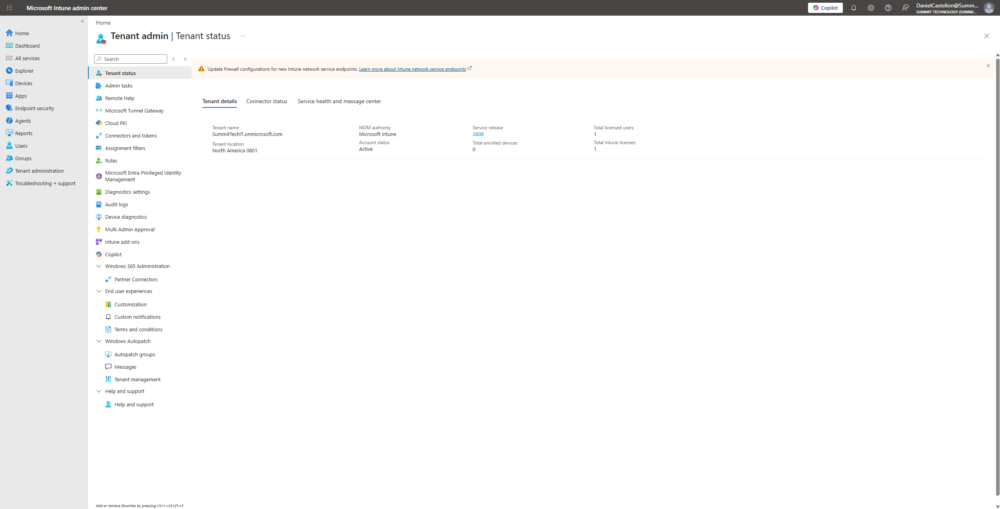

### MDM Enrollment Configuration

Automatic MDM enrollment was enabled for users in the tenant. This configuration allows supported Windows devices associated with Microsoft Entra ID accounts to automatically enroll into Microsoft Intune and become centrally managed endpoints.

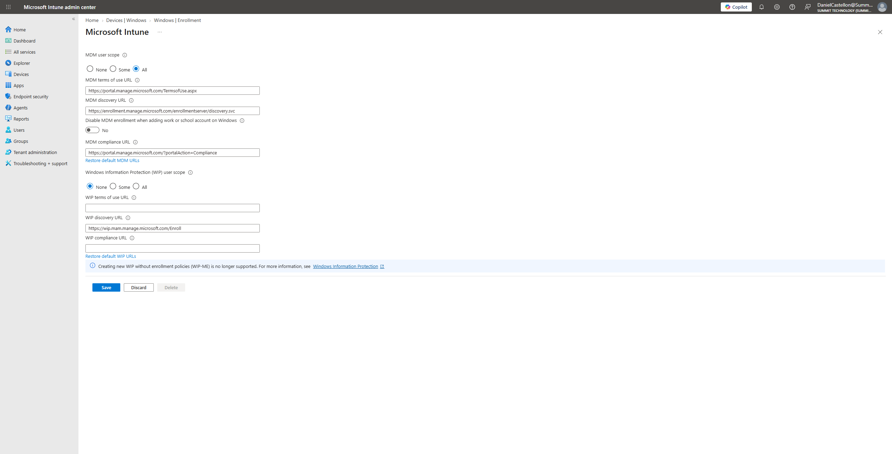

### Windows 11 Device Enrollment

A Windows 11 virtual machine was enrolled into Microsoft Intune and registered as a corporate-managed endpoint. The device appeared in the Intune admin center as SUMMIT-W11-01, confirming successful enrollment and communication with the Intune service.

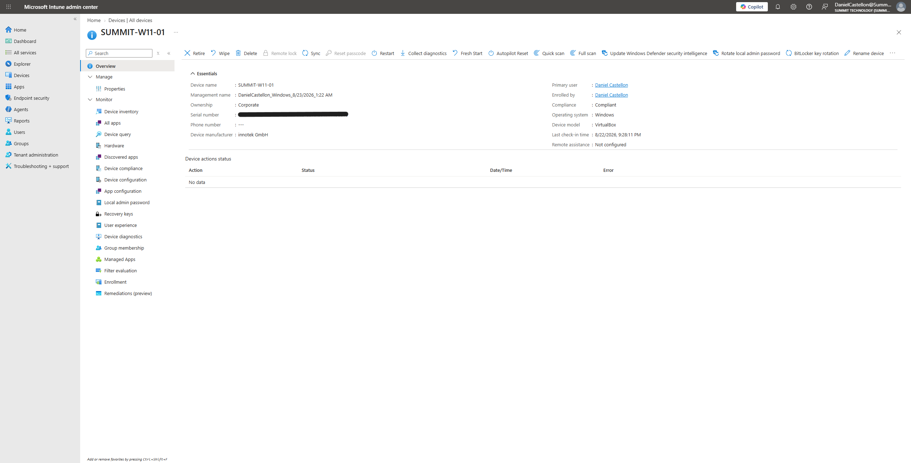

With the endpoint successfully enrolled, the device could now receive configuration profiles, compliance policies, endpoint security settings, applications, and remote management commands through Microsoft Intune.

## Windows Security Configuration & Compliance

After enrolling the Windows 11 endpoint into Microsoft Intune, security configuration and compliance policies were implemented to establish and enforce a baseline security posture for managed devices.

### Windows Security Configuration

A Windows security configuration profile was created using the Intune Settings Catalog. Microsoft Defender SmartScreen protections were enabled to help protect users from potentially malicious websites, downloads, and unwanted applications.

The configuration profile was assigned to managed Windows devices through Intune.

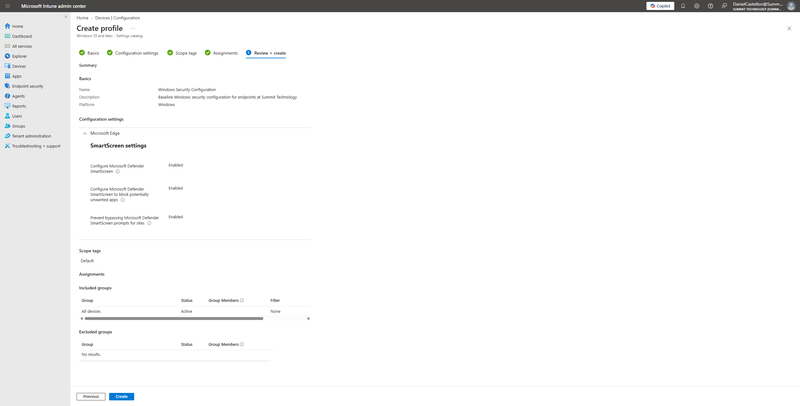

### Security Policy Deployment

After the configuration profile was assigned, Intune reported that the policy was successfully applied to SUMMIT-W11-01. This verified that the managed endpoint was communicating with Intune and receiving centrally deployed security configurations.

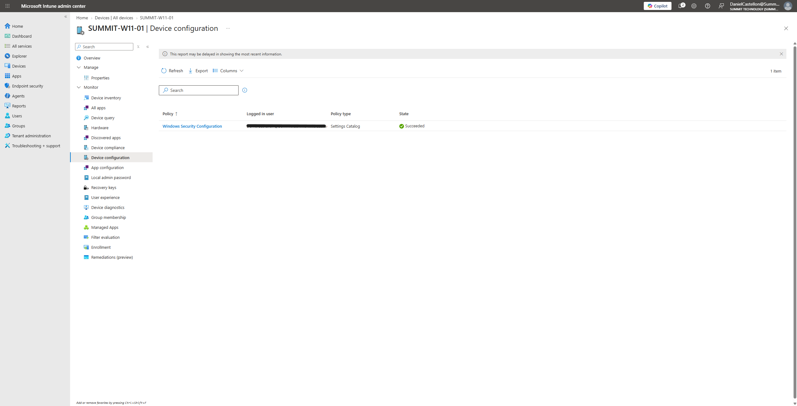

### Windows Compliance Policy

A Windows compliance policy was also created to define the security requirements that managed endpoints must satisfy.

The policy required key Windows security protections, including:

- Firewall protection
- Antivirus protection
- Antispyware protection
- Microsoft Defender Antimalware
- Up-to-date Microsoft Defender security intelligence
- Real-time protection
- A minimum supported Windows version

Devices that fail to meet the defined requirements are marked as noncompliant in Microsoft Intune.

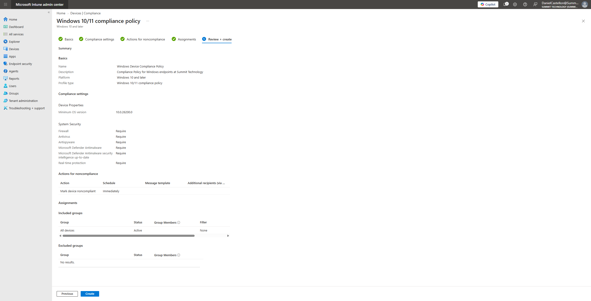

### Device Compliance Verification

After the compliance policy was deployed and evaluated, SUMMIT-W11-01 reported a compliant status for both the configured Windows compliance policy and the Intune default device compliance policy.

This confirmed that the endpoint satisfied the security requirements established for the environment.

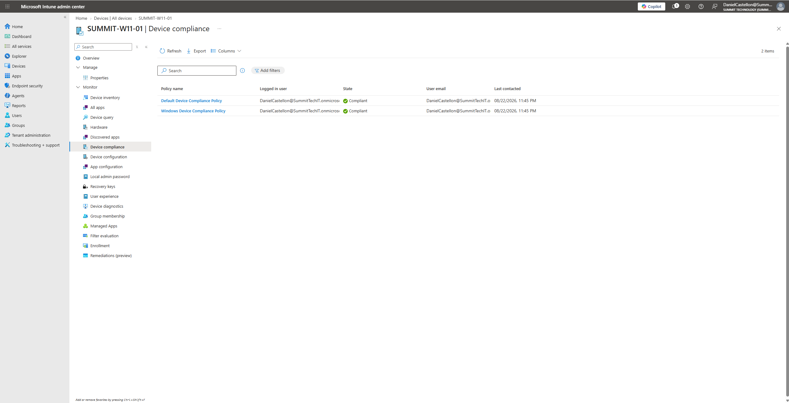

## BitLocker Encryption & Recovery Key Management

BitLocker drive encryption was implemented to protect data stored on the managed Windows endpoint. Microsoft Intune was used to centrally configure and deploy the encryption policy, while the endpoint was used to verify that encryption and key protection were successfully applied.

### TPM Verification

Before deploying BitLocker, the Windows 11 endpoint was verified to have a functional Trusted Platform Module (TPM). The TPM management console confirmed that the TPM was ready for use and supported TPM 2.0.

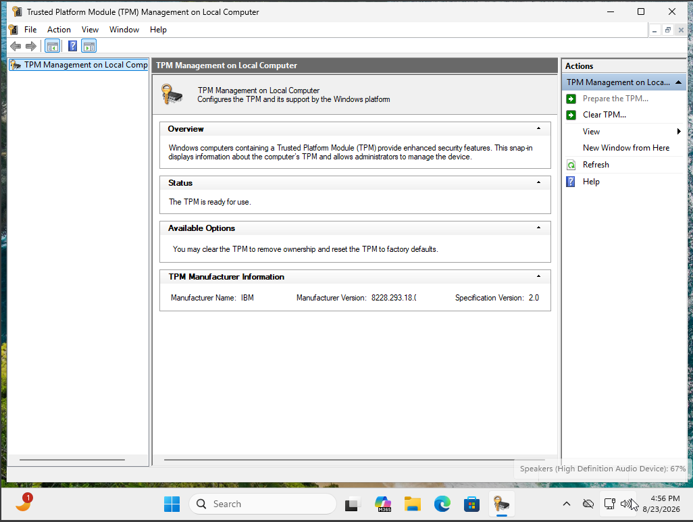

### BitLocker Policy Creation

A BitLocker disk encryption policy was created through the Endpoint Security section of Microsoft Intune.

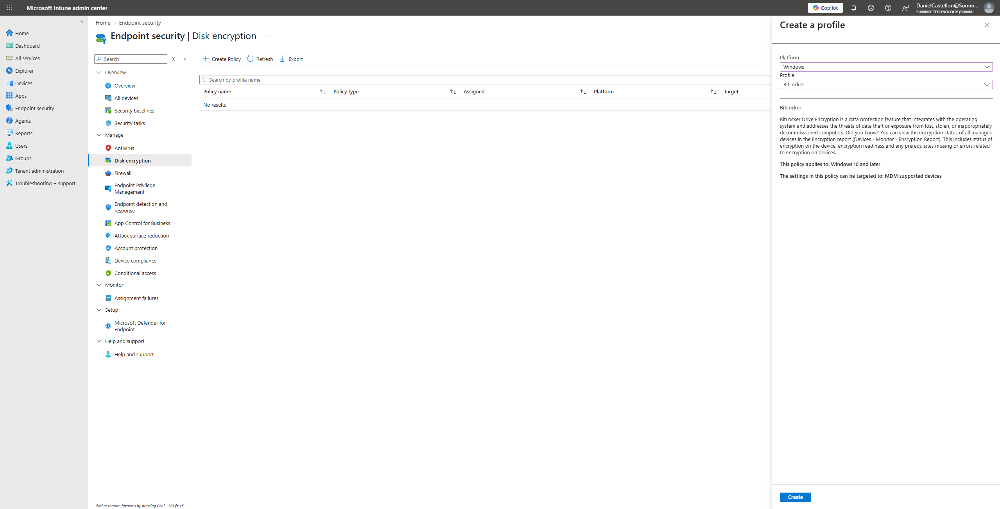

### Encryption and Recovery Configuration

The BitLocker policy was configured to require device encryption and define encryption and recovery settings for the operating system drive. Recovery information was configured to be backed up so that recovery credentials could be centrally accessed when needed.

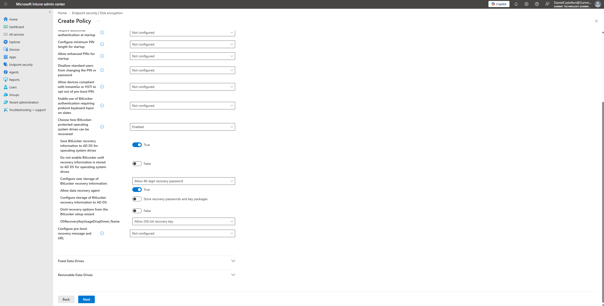

### Policy Review and Assignment

The completed BitLocker configuration was reviewed and assigned to the Summit Windows Devices group, allowing the encryption requirements to be centrally deployed to targeted Windows endpoints.

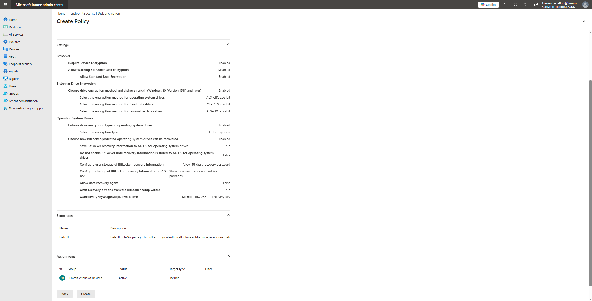

### BitLocker Policy Deployment

After deployment, Microsoft Intune reported a successful policy status with no errors or conflicts, confirming that the BitLocker configuration had been delivered to the targeted endpoint.

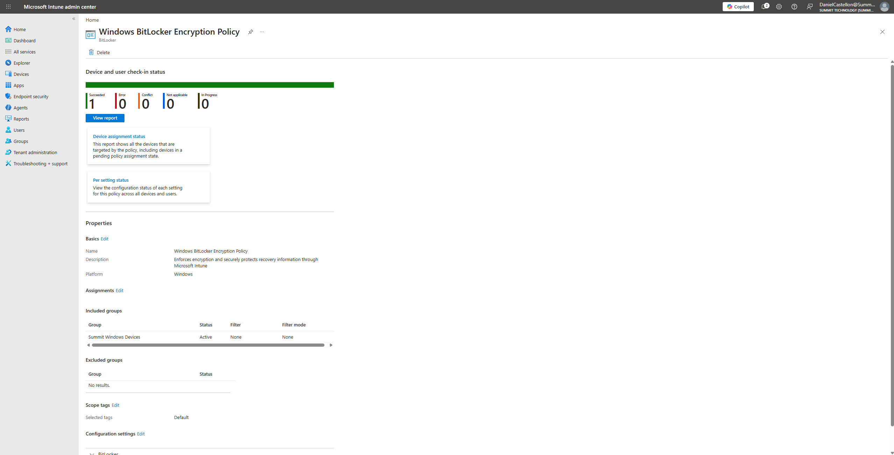

### Endpoint Encryption Verification

BitLocker status was verified directly from the Windows endpoint using the manage-bde command-line utility. The operating system drive reported encryption enabled with active key protectors, including TPM and a numerical recovery password.

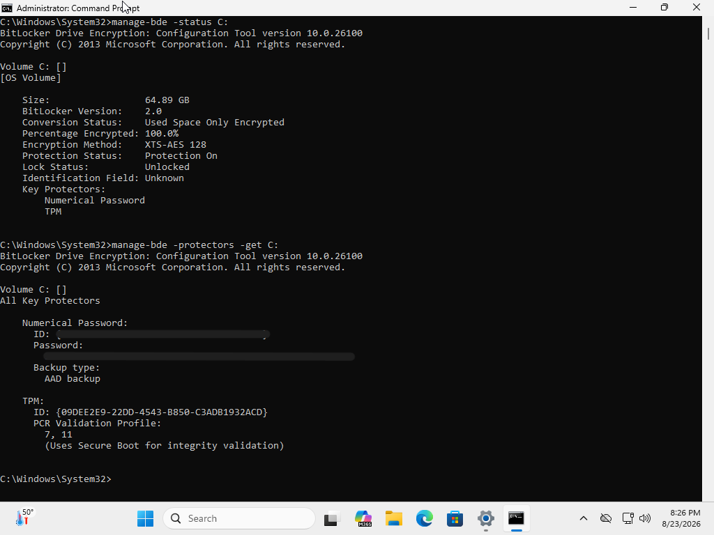

### Recovery Key Verification in Intune

The BitLocker recovery key was successfully backed up and made available through the managed device's recovery key information in Microsoft Intune. This demonstrated centralized recovery-key management for the encrypted endpoint.

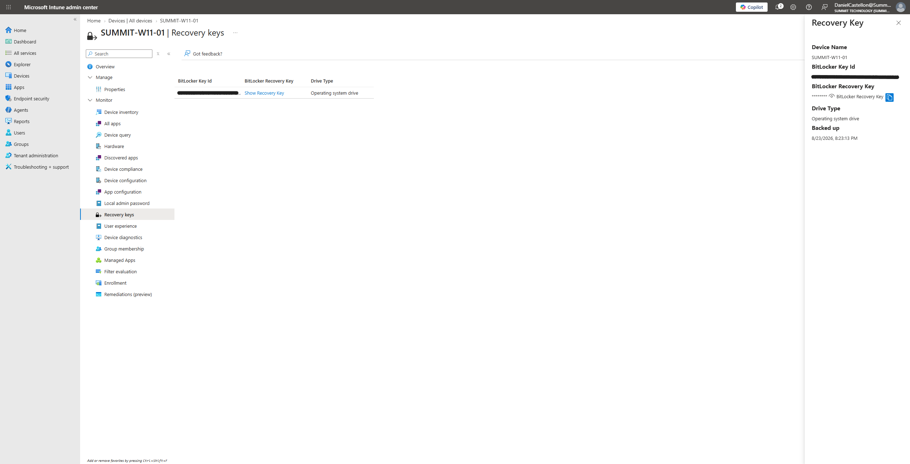

## Microsoft Defender Antivirus & Endpoint Protection

Microsoft Defender Antivirus protections were centrally configured through Microsoft Intune to strengthen endpoint security against malware, potentially unwanted applications, malicious network activity, and other threats.

### Microsoft Defender Security Policy

A Microsoft Defender Antivirus policy was created through Intune Endpoint Security and assigned to the Summit Windows Devices group.

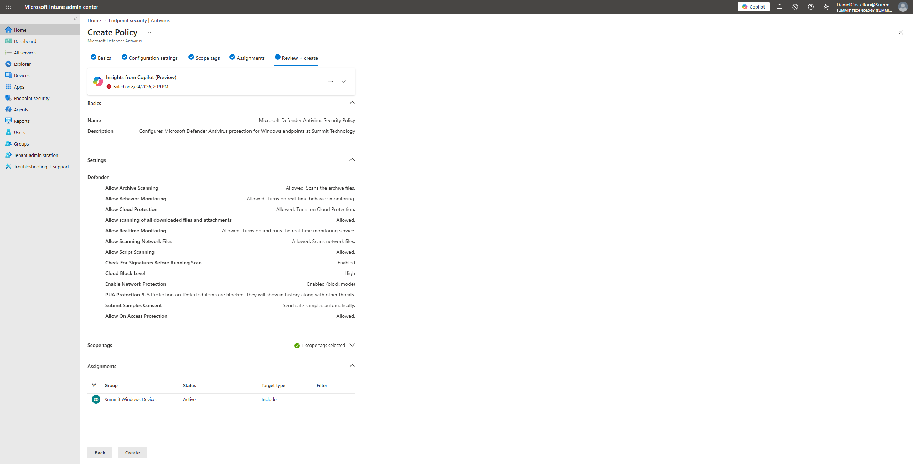

### Defender Policy Deployment

After deployment, Microsoft Intune reported successful check-in status for the Defender security policy with no errors or conflicts, confirming that the security configuration was successfully delivered to the targeted endpoint.

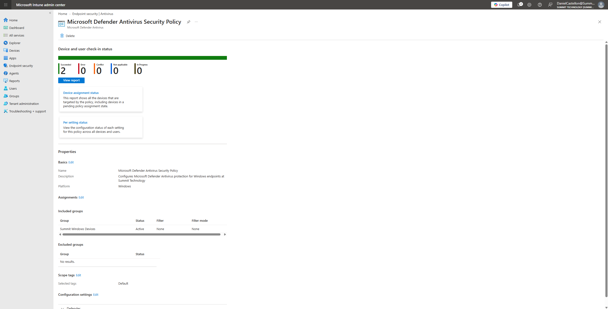

### Endpoint Protection Verification

The applied Microsoft Defender settings were verified directly on the Windows 11 endpoint using PowerShell.

Get-MpComputerStatus confirmed that antivirus, real-time protection, behavior monitoring, I/O antivirus protection, and antispyware protection were enabled.

Get-MpPreference was also used to verify additional policy-controlled settings, including PUA protection, network protection, script scanning, and real-time monitoring.

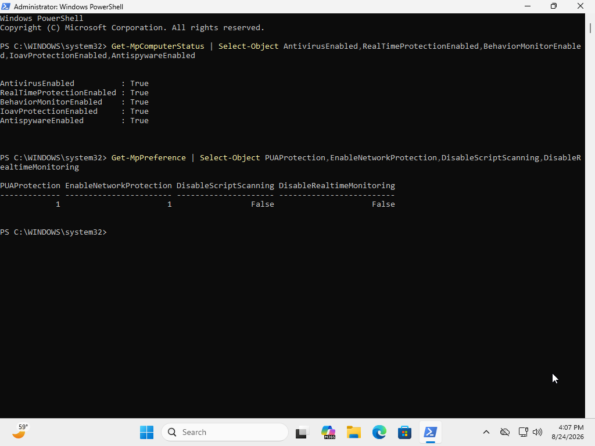

This verification demonstrated that the Microsoft Defender security configuration deployed through Intune was actively enforced on the managed Windows endpoint.

## Windows Autopilot Deployment & Provisioning

Windows Autopilot was configured to demonstrate automated provisioning of Windows devices through Microsoft Intune.

### Hardware Hash Collection

The device hardware information was collected using PowerShell and exported for registration with Windows Autopilot.

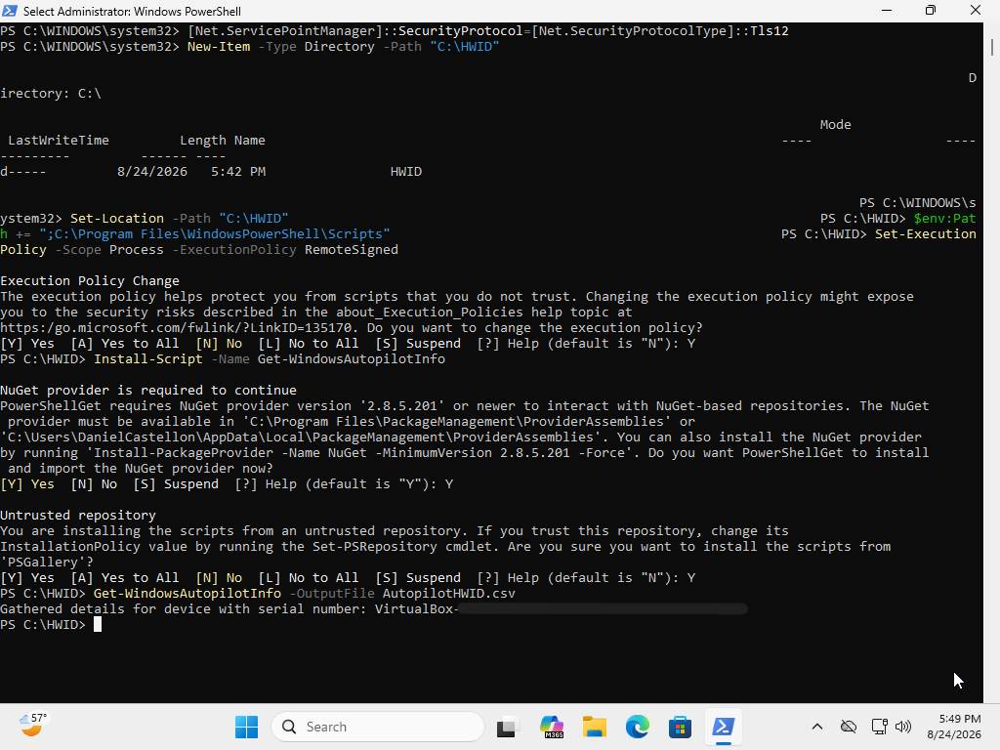

### Enrollment Status Page

An Enrollment Status Page (ESP) profile was configured to control the device setup experience and track required applications and policies during provisioning.

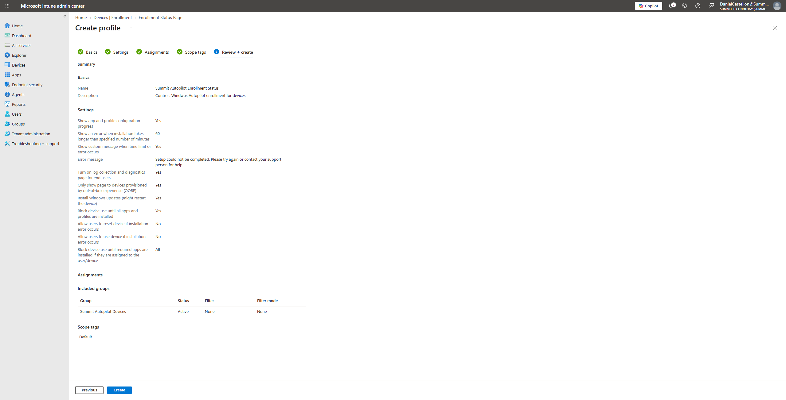

### Autopilot Deployment Profile

A user-driven Windows Autopilot deployment profile was created and assigned to the targeted device group. The profile configured the out-of-box experience (OOBE), Microsoft Entra ID join, and automated device naming.

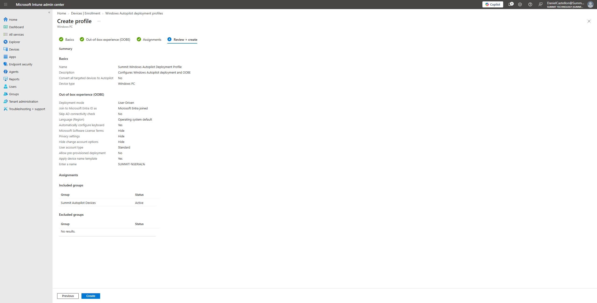

### Device Registration

The Windows device was successfully imported into Windows Autopilot and assigned a deployment profile, confirming that it was registered and ready for Autopilot provisioning.

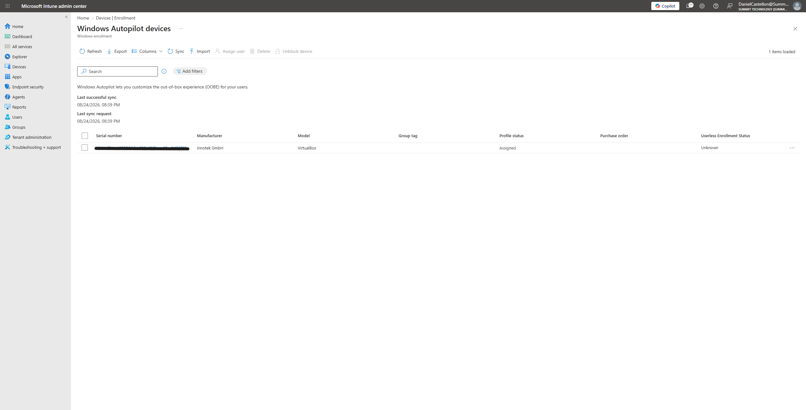

## Application Deployment with Microsoft Intune

Microsoft Intune was used to centrally deploy the Microsoft Company Portal application to the managed Windows 11 endpoint.

### Company Portal Deployment

Company Portal was deployed as a required application to the targeted device group. After the device synchronized with Intune, the application was automatically installed on **SUMMIT-W11-01**.

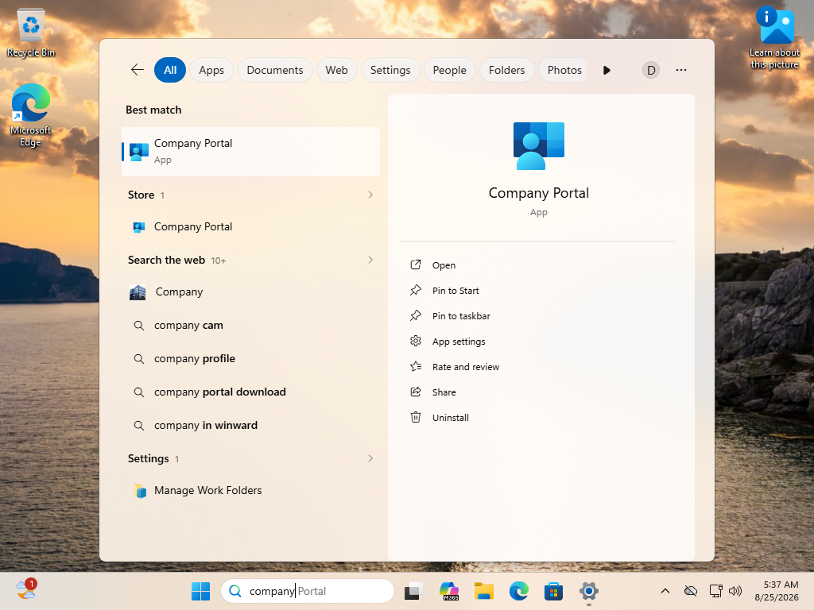

### Deployment Verification

The application deployment was verified through Intune's device install status, which reported Company Portal as successfully installed on the managed endpoint.

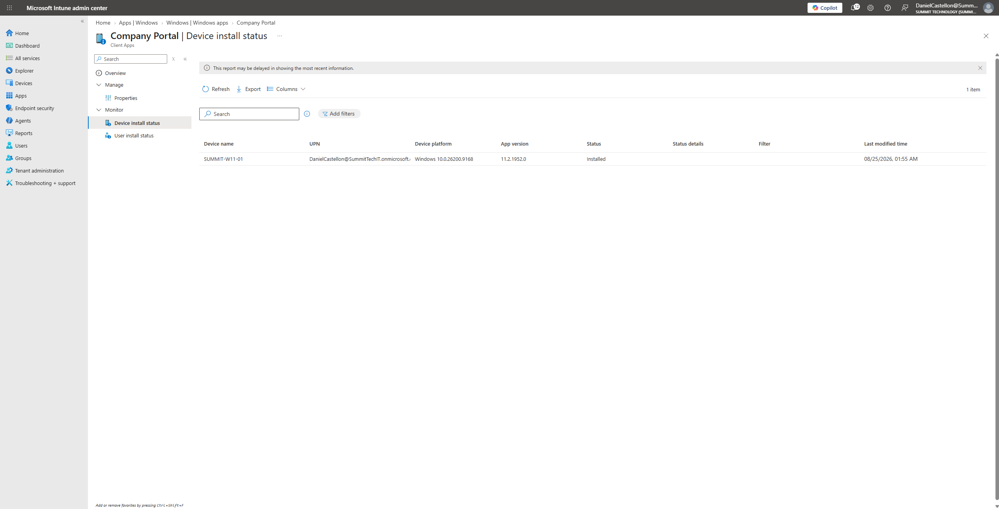

This demonstrated the ability to centrally deploy and verify applications on managed Windows devices using Microsoft Intune.

## Remote Device Management

Microsoft Intune was used to demonstrate remote administration of the managed Windows 11 endpoint.

### Remote Restart

A remote restart command was issued to **SUMMIT-W11-01** from the Intune admin center. The device successfully processed the command, and Intune reported the remote action as **Complete**.

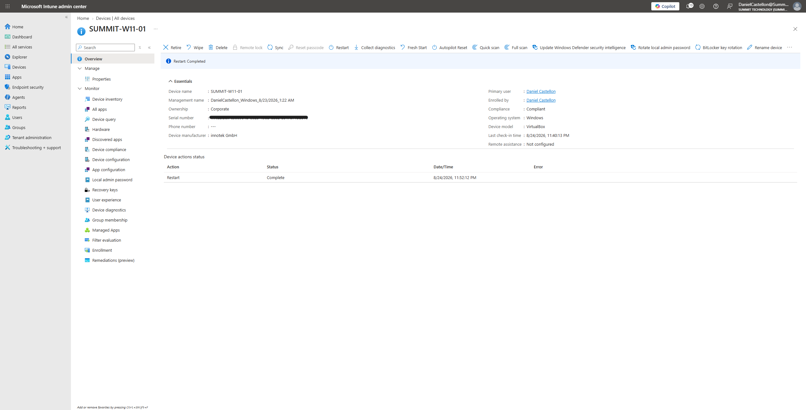

This demonstrated the ability to remotely perform administrative actions on managed endpoints through Microsoft Intune.
